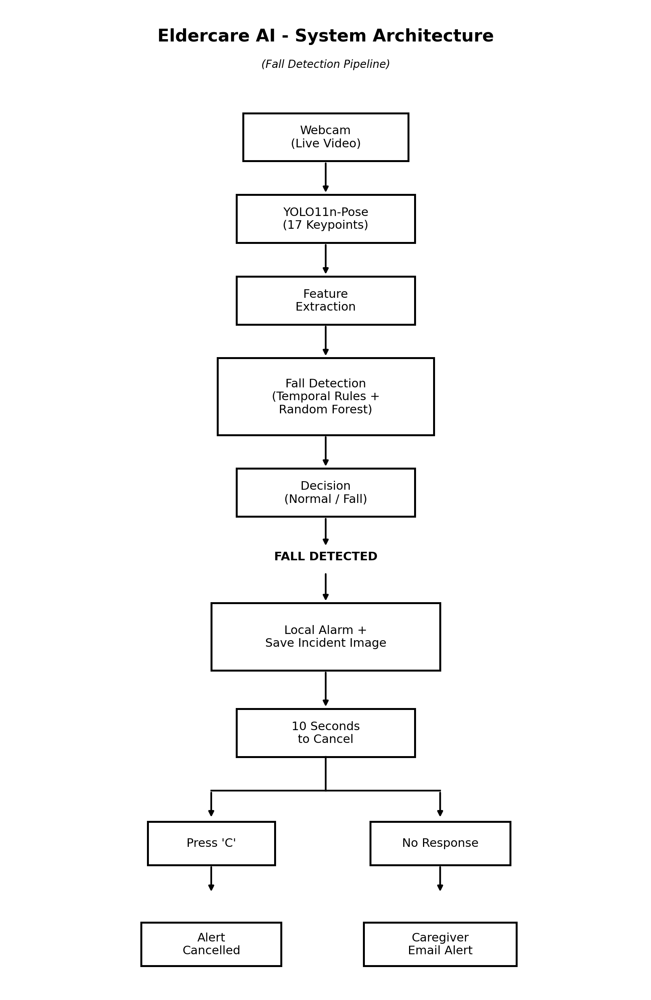

# ElderCare AI
## Real-Time Elderly Fall Detection and Caregiver Alert System

ElderCare AI is a real-time computer-vision and machine-learning system designed to detect potential falls of elderly individuals using a standard webcam.

The system combines **YOLO11 pose estimation**, temporal movement analysis, and a **Random Forest classifier** to distinguish potential falls from normal activities such as standing, sitting, and lying down.

When a fall is confirmed, the system activates a local alarm and gives the person a short opportunity to indicate that they are safe. If there is no response, the system automatically sends an email notification to a caregiver with the incident timestamp, detection score, and captured image.

---

# 1. Problem Statement

Falls are a major safety concern for elderly people, particularly those living independently.

After a serious fall, a person may be unable to reach a phone or request assistance. Delayed detection can increase the time before help arrives.

Traditional monitoring may require:

- continuous human supervision,
- wearable devices,
- manual emergency-button activation, or
- expensive dedicated monitoring equipment.

The objective of ElderCare AI is to explore whether computer vision and machine learning can provide automatic fall detection using an ordinary camera while minimizing unnecessary caregiver alerts.

---

# 2. Proposed Solution

ElderCare AI continuously analyzes a live webcam stream.

The system:

1. Detects the person's body pose.
2. Extracts movement and posture features.
3. Detects rapid downward movement.
4. Evaluates whether the resulting posture resembles a fall.
5. Rejects common non-fall activities such as sitting.
6. Uses a machine-learning classifier for additional verification.
7. Requires temporal persistence before confirming the event.
8. Saves an incident image when a fall is detected.
9. Activates a local audible alarm.
10. Provides a 10-second acknowledgement window.
11. Sends a caregiver email if the alert is not cancelled.
12. Logs predictions for later evaluation.

---

# 3. System Architecture



The video stream is processed automatically by the system. Continuous human monitoring is not required.

---

# 4. Technology Stack

| Component | Technology |
|---|---|
| Programming Language | Python |
| Computer Vision | OpenCV |
| Pose Estimation | Ultralytics YOLO11n-Pose |
| Machine Learning | Scikit-learn |
| ML Model | Random Forest |
| Numerical Processing | NumPy |
| Model Serialization | Joblib |
| Configuration | python-dotenv |
| Alert Mechanism | Gmail SMTP |
| Local Alert | Windows audio alarm |
| Dataset | UR Fall Detection Dataset |
| Development Environment | VS Code |

---

# 5. Dataset

The machine-learning component was developed using the **UR Fall Detection Dataset (URFD)**.

The dataset contains:

- fall sequences,
- Activities of Daily Living (ADL),
- RGB camera recordings,
- depth information,
- accelerometer information, and
- fall annotations.

For this project, RGB camera sequences were used together with pose estimation.

YOLO11n-Pose was applied to the RGB frames to extract human body keypoints.

The resulting pose information was converted into temporal sequences for machine-learning training.

---

# 6. Data Preparation

The final annotation-aware dataset contained:

- **1,500 sequences**
- **223 fall windows**
- **1,277 normal windows**
- **70 source recordings**

Each sample contains:

- **30 consecutive frames**
- **17 pose-derived features per frame**

Resulting sequence shape:

```text
(1500, 30, 17)
```

For the Random Forest classifier, each sequence was flattened before training.

---

# 7. Feature Engineering

The system derives pose and movement information including:

- hip position,
- torso orientation,
- body aspect ratio,
- bounding-box dimensions,
- body height characteristics,
- downward movement,
- low-body position,
- horizontal posture, and
- temporal movement information.

These features allow the system to evaluate not only where the person is located, but also how the person's posture changes over time.

---

# 8. Hybrid Detection Approach

A major design decision in this project was not to rely exclusively on the machine-learning classifier.

The system combines:

### Temporal Rule Engine

Detects physical characteristics associated with a fall, including:

- rapid downward movement,
- transition toward a horizontal posture,
- low body position,
- recent movement history, and
- rejection of likely sitting posture.

### Random Forest Classifier

Analyzes a 30-frame pose sequence and estimates the probability that the movement represents a fall.

### Temporal Confirmation

A possible fall must remain supported by the ML classifier for a short persistence period before it becomes a confirmed fall.

This hybrid architecture helps reduce false alarms caused by ordinary movements.

---

# 9. Model Development

Two machine-learning approaches were evaluated.

## Random Forest

Final held-out test results:

| Metric | Result |
|---|---:|
| Accuracy | 97.09% |
| Precision | 82.98% |
| Recall | 88.64% |
| F1 Score | 85.71% |

Confusion matrix:

```text
[[394   8]
 [  5  39]]
```

The final test set contained:

- 402 normal samples
- 44 fall samples

The Random Forest model was selected for the real-time application.

## LSTM Experiment

An LSTM sequence model was also evaluated.

Results:

| Metric | Result |
|---|---:|
| Accuracy | 83.70% |
| Precision | 42.86% |
| Recall | 87.93% |
| F1 Score | 57.63% |

The LSTM showed high fall sensitivity but generated substantially more false positives.

Therefore, the Random Forest classifier was selected for the final prototype.

---

# 10. False-Positive Reduction

During development, several important false-positive cases were identified.

### Normal lying

Early versions could interpret a person lying on a bed as a fall.

The temporal detector was modified so that horizontal posture alone is insufficient. A recent rapid downward movement is also required.

### Sitting

Fast sitting can resemble the downward movement of a fall.

Additional posture logic was therefore introduced to identify likely seated positions using torso orientation and body aspect ratio.

### ML-only false positives

Testing showed that the ML probability can temporarily become high during some normal movements.

For this reason, ML probability alone does not trigger an emergency alert.

A fall requires agreement between temporal fall evidence and persistent ML support.

---

# 11. Controlled Live Validation

A small controlled webcam validation was performed after the final detector tuning.

Test activities included:

- 3 normal sitting actions
- 3 fast sitting actions
- 2 normal lying-down actions
- 3 simulated falls

Observed result:

| Activity | Tests | Confirmed Fall Alerts |
|---|---:|---:|
| Normal sitting | 3 | 0 |
| Fast sitting | 3 | 0 |
| Normal lying | 2 | 0 |
| Simulated falls | 3 | 3 |

Therefore, in this limited controlled demonstration:

- **3/3 simulated falls were detected**
- **0/8 tested non-fall activities generated a confirmed fall alert**

These results represent a small controlled prototype test and should not be interpreted as general real-world accuracy.

---

# 12. Emergency Alert Workflow

When a fall is confirmed:

```text
Fall Detected
      |
      v
Incident Image Saved
      |
      v
Local Audible Alarm
      |
      v
10-Second Acknowledgement Window
      |
 +----+----+
 |         |
 v         v
Press C    No Response
 |             |
 v             v
Cancel      Caregiver
Alert       Email Alert
```

The caregiver email includes:

- alert information,
- timestamp,
- detection score, and
- incident image.

The `C` keyboard acknowledgement is used in the current prototype.

In a real deployment, this could be replaced with voice acknowledgement, a wearable button, or another accessible interface.

---

# 13. Privacy Considerations

The system is designed so that continuous human video monitoring is not necessary.

The live camera stream is analyzed locally by the AI system.

The caregiver is contacted only after a fall event is confirmed and the acknowledgement period expires.

Future versions should further improve privacy through:

- local edge processing,
- encrypted incident storage,
- configurable image retention,
- access control, and
- privacy-preserving pose-only monitoring.

---

# 14. Project Structure

```text
elderly_fall_detection_rt/
|
|-- app.py
|-- README.md
|-- requirements.txt
|-- start_fall_detection.bat
|-- yolo11n-pose.pt
|
|-- src/
|   |-- __init__.py
|   |-- alert_manager.py
|   |-- fall_detector.py
|   |-- feature_extractor.py
|   |-- ml_classifier.py
|   `-- pose_detector.py
|
|-- models/
|   `-- fall_classifier_annotated.pkl
|
|-- data/
|
|-- logs/
|
|-- incidents/
|
|-- docs/
|
|-- prepare_dataset.py
|-- train_model.py
`-- train_lstm.py
```

---

# 15. Installation

Create a Python virtual environment:

```powershell
python -m venv .venv
```

Activate it:

```powershell
.venv\Scripts\activate
```

Install dependencies:

```powershell
python -m pip install -r requirements.txt
```

---

# 16. Email Configuration

Create a `.env` file in the project root.

Example:

```env
EMAIL_SENDER=your_email@gmail.com
EMAIL_APP_PASSWORD=your_google_app_password
CAREGIVER_EMAIL=caregiver_email@gmail.com
```

Do not commit `.env` to source control.

The Gmail account should use a Google App Password rather than the normal account password.

---

# 17. Running the Application

Run with ML verification and caregiver alerts:

```powershell
python app.py --use-ml
```

Run without sending caregiver alerts:

```powershell
python app.py --use-ml --no-alert
```

Alternatively, on Windows, launch:

```text
start_fall_detection.bat
```

Controls:

```text
Q = Stop monitoring
C = Acknowledge/cancel pending caregiver alert
```

---

# 18. Logging

Each monitoring session creates a CSV prediction log.

The logs contain information such as:

- timestamp,
- detector state,
- detection score,
- ML probability,
- FPS, and
- detector reasoning/features.

These logs were used during development to investigate false positives and tune the temporal detector.

---

# 19. Limitations

The current system is a prototype and has several limitations.

- Performance can depend on camera position and viewing angle.
- Occlusion can reduce pose-estimation quality.
- Poor lighting can affect detection.
- Only one primary person is currently considered.
- The model was trained using a limited public fall dataset.
- Controlled webcam testing is not equivalent to clinical validation.
- Email alerts require internet connectivity.
- The acknowledgement mechanism currently uses a keyboard.
- The prototype is not a certified medical or emergency-response system.

---

# 20. Future Improvements

Future development could include:

- voice acknowledgement such as "I'm okay",
- wearable emergency-button integration,
- SMS/call/mobile push notifications,
- edge-device deployment,
- multiple-person tracking,
- night/low-light monitoring,
- additional fall datasets,
- larger real-world validation,
- automatic camera calibration,
- caregiver mobile application,
- encrypted incident management,
- configurable emergency contacts, and
- privacy-preserving skeleton-only processing.

---

# 21. Key Outcome

The project demonstrates an end-to-end AI safety pipeline:

```text
Computer Vision
      +
Pose Estimation
      +
Temporal Analysis
      +
Machine Learning
      +
False-Positive Reduction
      +
Real-Time Monitoring
      +
Emergency Notification
```

Rather than treating every lying posture as a fall, ElderCare AI analyzes the **transition and temporal behavior leading to the posture** and uses machine learning as an additional verification layer.

The result is a functional prototype capable of detecting simulated falls in real time and automatically escalating unattended events to a caregiver.